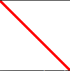
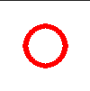

Drawing
=======

Pygame Extra has simple drawing functions, most are simply redirecting to pygame itself and don't really change in complexity

Line
----

Let's look at the syntax of drawing a line

.. code-block:: python

    pygameextra.draw.line(color, start_pos, end_pos, w)
Now let's take a closer look at the syntax

* color - the line color
* start_pos - the stating position of the line ``(StartX, StartY)``
* end_pos - the ending position of the line ``(EndX, EndY)``
* w - the line width
* update(optional) - setting this to false will disable the automatic screen update
* layer - the layer on witch to put the line

Rect
----

Let's look at the syntax of drawing a rect aka a rectangle

.. code-block:: python

    pygameextra.draw.rect(color, rect, w)
Now let's take a closer look at the syntax

* color - the rect / rect line color
* rect - the rect itself aka ``(StartX,StartY,SizeX,SizeY)``
* w (no fill) - setting this to be larger than 0 will make a line rect without fill
* w (with fill) - setting this to 0 will make the rect filled

Circle
------

Let's look at the syntax of drawing a circle

.. code-block:: python

    pygameextra.draw.circle(color, pos, radius, w)
Now let's take a closer look at the syntax

* color - the circle color
* pos - the center position of the circle
* radius - the radius of the circle from the center
* w (no fill) - setting this to be larger than 0 will make a line circle
* w (with fill) - setting this to 0 will make a filled circle

Ellipse
-------

Let's look at the syntax of drawing a ellipse

.. code-block:: python

    pygameextra.draw.ellipse(color, rect)
Now let's take a closer look at the syntax

* color - the ellipse color
* rect - the rect of the ellipse
