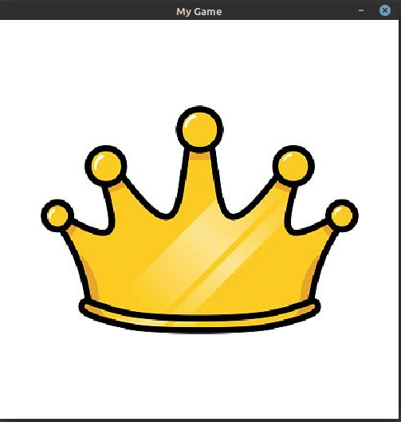
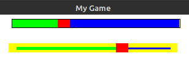

General GUI
===========

Let's use the Pygame Extra UI functions, to make some UI!!!

Text
----

Here comes a really good optimization in Pygame Extra, after making a text you can init it once and then not worry about it, until you want to change any aspect of the text!
Let's look at how to make a simple text

.. code-block:: python
    
    pe.text.quick.small('TEXT', position, layer=0)
    
Here you have to understand that when we put our text at say ``(0, 0)`` we put the center of our text at ``(0, 0)``.
To avoid the text from going off screen or such we can use ``pe.math.center``, let's see how, we'd do that!

.. code-block:: python

    import pygameextra as pe
    pe.display.make((500, 500), 'My Game')
    text = pe.text.quick.small('TEXT', pe.math.center((0, 0, 500, 500), layer=0))
    pe.fill.full(pe.color.white)
    while True:
      for pe.event.c in pe.event.get():
        pe.event.quitcheckauto()
      pe.text.display(text)
    pe.quit()
    quit()

.. image :: _static/docs03.png
    :align: left
    
As you can see the text is now centered in the middle of our screen, if you wish to get bigger sizes or set a custom size here's how:

* pe.text.quick.small('small TEXT', position, layer=0)
* pe.text.quick.medium('medium TEXT', position, layer=0)
* pe.text.quick.large('large TEXT', position, layer=0)
* pe.text.quick.make('custom TEXT', fontsize, position, layer=0)

Also do note that you can make much more detailed texts by either editing the quick texts or simply making a normal text!

It's also important to note that when making buttons you'll need to make texts separately for the buttons.

Ok so let's look at how to edit a text's properties.

The text includes a few properties, here's all:

* text - the main text contents
* font - the font of the text
* fontsize - the size of the text font
* pos - the center position of the text
* color - the text color
* background - the background color of the text
* fonto - this is a init variable aka used to display the text
* texto - this is a init variable aka used to display the text
* textRect - this is a init variable aka used to display the text

Now let's take a look at how to make our own text from scratch.

Let's make a white colored text with a yellow background, and a large font size!

Here is the syntax:

.. code-block:: python

    pe.text.make(text, font, fontsize, position, colors, layer=0)
    
You'll notice the color and background are merged into the variable colors!

Now let's make the text:

.. code-block:: python
    
    pe.text.make('custom text', 'freesansbold.ttf', 35, pe.math.center((0,0,500,500)), (pe.color.white, pe.color.yellow))
    
If we replace the old quick text with this line we get this:

.. image :: _static/docs04.png
    :align: center
    
Isn't that nice, one last thing though, if we want to change any property, we need to init the text after we change that property:

.. code-block:: python

    text.background = pe.color.red
    text.init(text)
    
if we don't init the text, the changes won't be applied, think of it as a 'save changes' line.

Images
------

Pygame Extra has a custom image object, consisting of the image and it's rect, let's see how we load an image from file and display it!

For this example let's say we have example.jpeg, let's look at the syntax:

.. code-block:: python

    pe.image.load(file, size, position, layer=0)

* file - the image path
* size - the size the image will display as
* position - the top-left of the image

Let's display the image on the entire screen!

.. code-block:: python

    import pygameextra as pe
    pe.display.make((500, 500), 'My Game')
    image = pe.image.load('example.jpeg',(500,500),(0,0))
    pe.fill.full(pe.color.white)
    while True:
      for pe.event.c in pe.event.get():
        pe.event.quitcheckauto()
      pe.image.display(image)
      pe.display.update()
    pe.quit()
    quit()

    
As you can see we use the following 2 lines to display the image, the image even though displayed, the screen doesn't update until we tell it to.
This is basically all there is to displaying an image on screen

Buttons
-------

Instead of going trough the trouble of making a button function, Pygame Extra offers one right out the box!

Here we have two button options:

* rect - a normal square button
* image - a button made of image(s)

Let's start with the syntax for both buttons, it's pretty much the same:

.. code-block:: python

    pe.button.rect(rect, ic, ac, Text, action, data, tmp, layer=0)
    pe.button.image(rect, ic, ac, action, data, tmp, layer=0)

Ok let's go over everything one by one, starting with the rect button.

* rect - this is the rect of the button, say we wanna make a button from (0, 0) and make it a size of 50 x 50, we would simply use: ``(0,0,50,50)``
* ic,ac - these are the 2 colors of the button, one for button idle, and one for hover.
* Text - the text that is placed on top of the button.
* action - this is the function that gets called when the button is clicked.
* data - if this is not None, then the action will be called with this data.
* tmp - this is True by default, setting it to False will disable the automatic screen update

Now the image button specific syntax.

* ic,ac - these are the 2 images of the button, one for button idle, and one for hover.

Yes everything else is basically the same.

Now let's look at some examples:

.. code-block:: python

    import pygameextra as pe
    pe.display.make((500, 500), 'My Game')
    text = pe.text.quick.small('TEXT', pe.math.center((0, 0, 500, 500)))
    pe.fill.full(pe.color.white)
    def action(data):
      print(data)
    while True:
      for pe.event.c in pe.event.get():
        pe.event.quitcheckauto()
      pe.button.rect((0,0,50,50),pe.color.red,pe.color.green,text,action,'DATA',True)
    pe.quit()
    quit()
    
.. image :: _static/docs05.png
    :align: left
    
As you can see the button is red and clearly says 'TEXT', now let's see what happens when we hover over and click it.

.. code-block:: python

    def action(data):
      print(data)
    
.. image :: _static/docs06.png
    :align: right

As you can see the button is green and upon clicking it, the action is called with our data, and 'DATA' is printed in the terminal, you can do much more, since your just calling a function!

Now let's take a look at the image button, for this example we have 2 images in our script folder, idle.png and hover.png, let's put them to use!

.. image :: _static/docs07.png
    :align: left

.. image :: _static/docs08.png

Now let's make a image button, first we need to load both images, then we simply call the ``button.image()`` function and we're done!

.. code-block:: python

    import pygameextra as pe
    pe.display.make((500, 500), 'My Game')
    idle = pe.image.load('idle.png',(50,50),(0,0))
    hover = pe.image.load('hover.png',(50,50),(0,0))
    pe.fill.full(pe.color.white)
    def action(data):
      print(data)
    while True:
      for pe.event.c in pe.event.get():
        pe.event.quitcheckauto()
      pe.button.image((0,0,50,50),idle,hover,action,'DATA',True)
    pe.quit()
    quit()

.. image :: _static/docs10.png
    :align: left

As you can see the button image is idle.png, when the button is idle.

.. code-block:: python

    def action(data):
      print(data)

.. image :: _static/docs11.png
    :align: right
    
As you can see the button image is hover.png, when the button is hovered, and upon click the action function is called.

This is basically everything there is to know about buttons, i might of over complicated it a little, but it's really simple in context.

Bellow you'll find an example featuring both button types

.. code-block:: python
    
    import pygameextra as pe
    pe.display.make((500, 500), 'My Game')
    text = pe.text.quick.small('TEXT', pe.math.center((0, 0, 500, 500)))
    idle = pe.image.load('idle.png',(50,50),(0,0))
    hover = pe.image.load('hover.png',(50,50),(0,0))
    pe.fill.full(pe.color.white)
    def action(data):
      print(data)
    while True:
      for pe.event.c in pe.event.get():
        pe.event.quitcheckauto()
      pe.button.rect((0,0,50,50),pe.color.red,pe.color.green,text,action,'Rect',True)
      pe.button.image((55,0,50,50),idle,hover,action,'Image',True)
    pe.quit()
    quit()

Sliders
-------

Pygame Extra has very nice sliders, let's have a look!

There's actually two types of sliders, the normal slider and the boxed slider, let's look at the syntax:

.. code-block:: python

    pe.slider.normal(rect, imageS, minS, maxS, current, back, color, w, enableT, colorT, wT, layer=0)
    pe.slider.boxed(rect, imageS, minS, maxS, current, back, lineout, color, enableT, colorT, layer=0)
    
Phew! a lot to take in huh, let's go over everything one by one:

* rect - the rect here is the same as the button rect ``(startX,startY,sizeX,sizeY)``
* imageS (image mode) - if you want a custom image for the slider itself you'd supply it here
* imageS (rect mode) - if you want to simply use a rect for the slider itself you'd supply it here
* minS - the minimum amount of the slider aka '0'
* maxS - the maximum amount of the slider aka '100'
* current - the current amount of the slider
* back - the background color of the slider aka it's rect
* lineout(only boxed slider) - the box outline
* color - the slider line color
* w(only normal slider) - the slider line width

Here comes an optional part, if you want a fancy slider you can add a second slider line, this would be the death line, aka the line that is after the slider itself

* enableT - this enables the second slider line
* colorT - the second slider line color
* wT(only normal slider) - the second slider line width

The imageS (image mode) isn't quite tested so we'll be only be looking at the imageS (rect mode).

Let's look at some examples already!

.. code-block:: python

    import pygameextra as pe
    pe.display.make((500, 500), 'My Game')
    pe.fill.full(pe.color.white)
    sO = 50
    sT = 50
    while True:
      for pe.event.c in pe.event.get():
        pe.event.quitcheckauto()
      sO = pe.slider.boxed((30, 100, 250, 15, 20), (255,0,0), 0, 100, sO, (255, 255, 0), (0, 0, 0), (0,255,0), True, (0,0,255))
      sT = pe.slider.normal((350, 100, 250, 15, 20), (255,0,0), 0, 100, sT, (255, 255, 0), (0,255,0), 5 ,True, (0,0,255), 3)
    pe.quit()
    quit()
    

You'll notice that we have to store the current slider amount, and supply it every time.

The slider automatically protects you from other interactions while your dragging.

Do note sliders are in very early making, you will get lag and errors very quickly, so i'd not recommend using these sliders yet...
