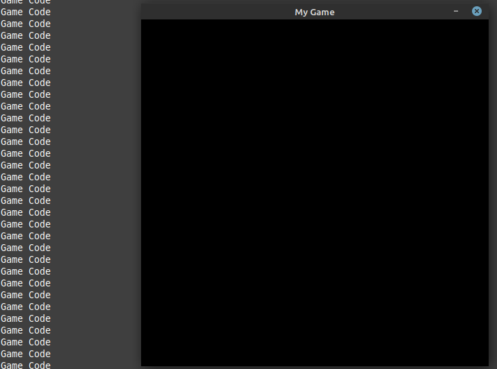

Getting Started
===============

Let's get started and learn how to use the tools of simplicity and make quick and cool games / applications.

Simple Loop
-----------

Let's get started by making a simple game loop, this loop will run our game code, on every frame, let's see how you'd make that in Pygame Extra.

.. code-block:: python

    import pygameextra as pe
    pe.display.make((500, 500), 'My Game')
    while True:
      for pe.event.c in pe.event.get():
        pe.event.quitcheckauto()
      print("Game Code")
    pe.quit()
    quit()

Running this will make a 500 x 500 display called "My Game" and close once the "X"(close) is clicked.

As you can see we still have nothing on screen, but we can see the message "Game Code" shows up every frame!

Filling the background
----------------------

After making our basic game loop, let's fill the background with white on every frame!
For that we simply use the method: 

.. code-block:: python

  fill.full(color, update=True, layer=0)

Here we have two options we can either manually set the color or use "``pe.color``".

.. code-block:: python

    import pygameextra as pe
    pe.display.make((500, 500), 'My Game')
    while True:
      for pe.event.c in pe.event.get():
        pe.event.quitcheckauto()
      pe.fill.full(pe.color.white)
    pe.quit()
    quit()
    
.. image:: _static/docs02.png
    :align: left
    
As you can see white is filling the entire screen. This is the basic things you need to know when starting to use Pygame Extra.

Maximum Frames Per Second
-------------------------

When making a game / program it's important to have a stable frame-rate, we can set the max frames per second by using the following command:

.. code-block:: python
    
    pe.time.tick(MaxFPS)
    
This will limit the game / program to a maximum frame-rate, we can't tell the game what the minimum frame-rate has to be, that depends on the user's machine.
