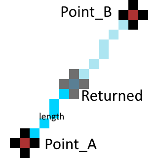

Math
====

Let's look at some math functions!

Rect Center
-----------

Using math.center we can get the center position of a rect.

Syntax:

.. code-block:: python

    math.center(rect)

So if you do the following, for example:

.. code-block:: python

    print(math.center((0,0,100,100)))

The rect starts at 0,0 and expands 100 x 100 this means the middle of this rect is at 50, 50 and this is exactly what this returns

.. code-block:: python

    (50,50)

If your using pe.rect() then simply use the embedded function of rect.center

Lerp
-----------

This is a powerful math function for measuring a point between 2 points

Syntax:

.. code-block:: python

    math.lerp(point_a, point_b, length)

This function starts at point_a and goes length distance to point_b.
Imagine this as the walk function in scratch, the function places itself on point_a and looks toward point_b, it then walks toward point_b for the length of distance given.

I hope you understand what i mean, but here is an image to help with what i just explained 

