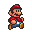
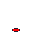

Sprites
=======

Sprites are a great part of Pygame Extra, let's use them!

Syntax
------

Here is the syntax, running this will return the sprite object:

.. code-block:: python

    pe.Sprite(imagef, size, position, rotation=0, layer=0)

Now let's go over everything:

* imagef - this is the image file(s), aka the sprite file
* size - the sprite size in pixels, aka the image size
* position - the center position of the sprite
* rotation - the rotation of the sprite, this is automatically set to 0, so you don't have to set it, unless you want the image to start off rotated
* layer - the layer the sprite is rendered on

Variables
---------

Great, now the variables of a sprite:

* image - the loaded image object(s)
* rotation - the rotation value
* position - the center position value or (x,y)
* rect - aka size
* size - the size multiplier of the sprite, this is one by default
* new - the updated image aka the current sprite with all its values loaded on
* refresh - this is a variable for the user to use, to keep track of whether a sprite should be updated, this variable is only in place to save time, it's set to True by default
* layer - the layer the sprite is on
* step - the amount the animation steps each game loop cycle
* ping_pong - the way the animation is player, if "True" the animation will go ``1,2,3,2,1``

Init
----

There's something very important to keep in mind, when you edit a sprite's variable, that really all your doing, is editing variables, to make pygame use these variables and make the new image we do:

.. code-block:: python

    spriteOBJ.init()
    
If you don't want to init the entire sprite that's fine, there's an init for everything separately!

.. code-block:: python

    spriteOBJ.init_rotation()

.. code-block:: python

    spriteOBJ.init_position()

All sprite inits return the "new" aka "spriteOBJ.new" variable, witch has been updated, from there you can display it with:

.. code-block:: python

    spriteOBJ.display()

Making and Displaying
---------------------

Let's put all that knowledge into making a sprite!

.. code-block:: python

    import pygameextra as pe
    pe.display.make((500, 500), 'My Game')
    pe.fill.full((255,255,255))
    crown = pe.Sprite('example.jpeg',(100,100),(250,250), 70)
    crown.init()
    while True:
      for pe.event.c in pe.event.get():
        pe.event.quitcheckauto()
      crown.display()
      pe.display.update()
    pe.quit()
    quit()

.. image:: _static/docs16.png
    :align: center

Animation
---------

Let's look over everything we can do to animate sprites!

Frames
++++++

For animation we need to specify 2 or more images.
To do that we simply supply a "list" of image files.
Say we have 4 walking animation frames:

.. code-block:: python

    walk = pe.Sprite(["walk_01.png", "walk_02.png", "walk_03.png", "walk_04.png"],(100,100),(250,250), 0)

By default the image to be frame will be the first frame, in this case, "walk_01.png", to set the frame manually we would do:

.. code-block:: python

    walk.frame = x  # replace x with the frame you wish to switch to.

That's great, now when you want to display it, the selected frame will be displayed.

**Note**: even though the frames are stored in a list starting with 0, the first frame is 1, and when displayed it will be subtracted to 0!

Stepping
++++++++

It would be easier if the sprite could automatically step trough each frame, and that is an option.
Simply setting the step variable, every time the sprite goes to display, if will step that amount of frames.

Say we have:

.. code-block:: python

    walk.step = 0.05

Depending on the frame-rate if you we're to display the sprite every game loop, it should animate!

Sadly i can't show you animation, but here is an example code and images for you to try!

.. image:: _static/mario/mario_01.png

.. image:: _static/mario/mario_02.png

.. code-block:: python

    import pygameextra as pe
    pe.display.make((500,500), "Mario")
    mario = pe.Sprite(["mario_01.png", "mario_02.png", "mario_03.png", "mario_03.png", "mario_04.png"],(500,500),(0,0), 0)
    mario.step = 0.1
    while True:
        for pe.event.c in pe.event.get():
            pe.event.quitcheckauto()
        pe.fill.full(pe.color.white)
        mario.display()
        pe.display.update()
        pe.time.tick(60)

Ping-pong
+++++++++

Ping pong is a function where the animation will, like the name suggests, jump back and forth between the first and last frame, instead of looping back to the first one when getting to the end

Say we have:

.. code-block:: python

    walk.step = 0.05
    walk.pingpong = True

Fact: for ping-pong to work the display function will allocate a variable to remember in witch way to pong, this variable is also known as the step multiplier or:

.. code-block:: python

    walk.step_m = 1

Here's a ball example:

.. image:: _static/ball/ball_03.png

.. image:: _static/ball/ball_09.png

.. code-block:: python

    import pygameextra as pe
    pe.display.make((500,500), "Ball")
    ball = pe.Sprite(["ball_12.png", "ball_13.png", "ball_01.png", "ball_02.png", "ball_03.png", "ball_04.png", "ball_05.png", "ball_06.png", "ball_07.png", "ball_08.png", "ball_09.png", "ball_10.png", "ball_11.png"],(500,500),(0,0), 0)
    ball.step = 0.1
    ball.frame = 3
    ball.pingpong = True
    while True:
        for pe.event.c in pe.event.get():
            pe.event.quitcheckauto()
        pe.fill.full(pe.color.white)
        ball.display()
        pe.display.update()
        pe.time.tick(60)

Sprite from image
-----------------

If you already have a loaded image and would like to use it for a sprite, you can simply supply it!

.. code-block:: python

    ball_i = pe.image.load("ball_01.png"...)
    ball = pe.Sprite(ball_i...)

**Note**: once a image or file path is supplied you can't change to the other, aka this would return an error:

.. code-block:: python

    ball_i = pe.image.load("ball_01.png"...)
    ball = pe.Sprite([ball_i,"ball_02.png"]...)

And this will also return an error:

.. code-block:: python

    ball_i = pe.image.load("ball_02.png"...)
    ball = pe.Sprite(["ball_01.png", ball_i]...)

SpriteSheet Animation
---------------------

Using a sprite sheet for sprite animation is very easy, but first we need to determine the type of sprite sheet animation, let's look at the 2 types of sprite sheet animation PGE can read:

.. image:: _static/rows.png

**Rows**

and **Columns**

In Pygame Extra, these types are know as

.. code-block:: python

    pe.sheet.rows
    pe.sheet.columns

So how do we use this to make a sprite sheet animated sprite?

With Rows
+++++++++

Loading a rows based sprite image is easy, we simply supply it to a sprite:

.. code-block:: python

    pe.Sprite(pe.sheet(file, cellsize, pe.sheet.rows, offset)...)

The syntax:

* file - the sprite sheet image file
* cellsize - the size of each
* offset - the sprite sheet offset, leaving this empty is recommended

With Columns
+++++++++

Loading a rows based sprite image is easy, we simply supply it to a sprite:

.. code-block:: python

    pe.Sprite(pe.sheet(file, cellsize, pe.sheet.columns, offset)...)

The syntax:

* file - the sprite sheet image file
* cellsize - the size of each
* offset - the sprite sheet offset, leaving this empty is recommended